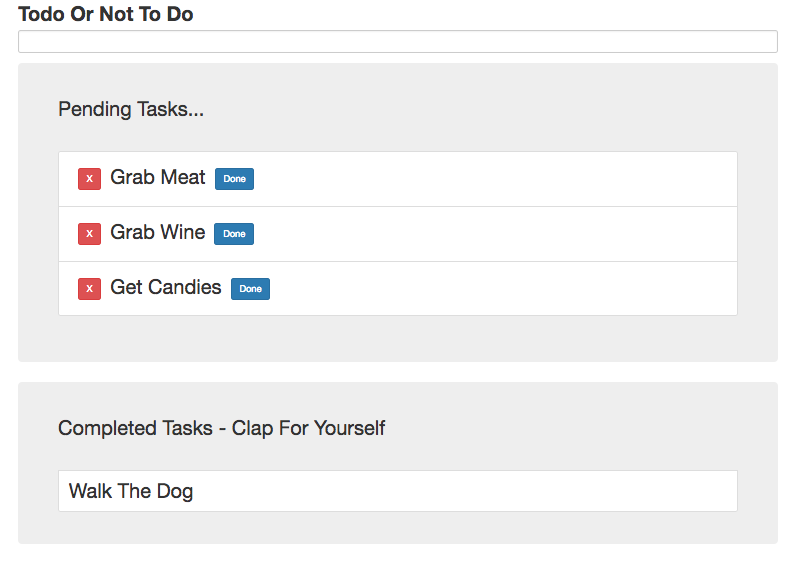

# ReactJs_To Do App

A simple To Do List Using **React** **ReactDOM** **Babel** & **BootStrap** CDN 

It Inclues A Pending List And A Completed List To Keep Track of Tasks. 

[Live Link](http://13.58.210.205/)

To Run The Application 

* `git clone https://github.com/RohitoOo/ReactJs_ToDoApp.git`
* Open `index.html` File Locally 

